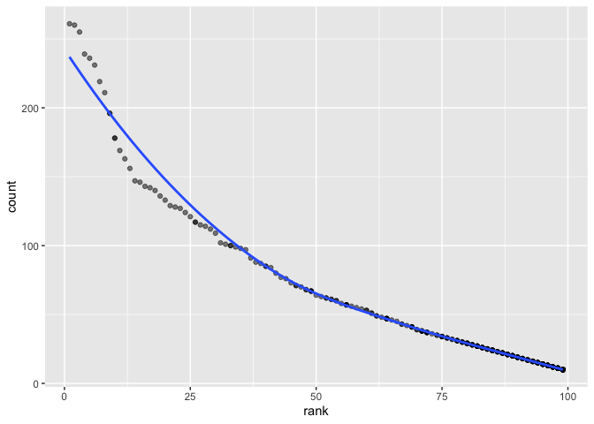

p8105\_hw2\_yj2579
================
Yingxi Ji
9/25/2019

## Problem 1

``` r
# Import and clean the data
trash_data = read_excel("./data/Trash-Wheel-Collection-Totals-8-6-19.xlsx",
                        sheet = 1, range = "A2:N408")%>%

janitor::clean_names() %>% 
drop_na(dumpster) %>% 

# change 'sports_balls' to integer
mutate(
    sports_balls = as.integer(sports_balls)
)
```

``` r
# import the data of 2017 and change the month from number to English words
Precipitation_2017 = read_excel("./data/HealthyHarborWaterWheelTotals2018-7-28.xlsx", sheet = 4, range = "A2:B14") %>% 
  mutate(year = "2017", Month = month.name)
  
# import the data of 2018 and change the month from number to English words
Precipitation_2018 = read_excel("./data/HealthyHarborWaterWheelTotals2018-7-28.xlsx", sheet = 3, range = "A2:B14") %>% 
  mutate(year = "2018", Month = month.name) %>% 
drop_na()

# Combine 2017 data and 2018 data
precipitation_data = as.tibble(rbind(Precipitation_2017, Precipitation_2018 )) 
```

    ## Warning: `as.tibble()` is deprecated, use `as_tibble()` (but mind the new semantics).
    ## This warning is displayed once per session.

``` r
# Alternative way of combining the table
#full_join(
  # Precipitation_2017, Precipitation_2018, by = "Month"
   # ) %>% 
#mutate(precipitation_data, Month = month.name)

trash_data_2017 = filter(trash_data, year == "2017")
```

Mr.trashwell has 344 observations and key variables are weight\_ton,
dumpster and other 12 variables; precipitation of 2017 has 12
observations and 3 variables including month, total, and year;
precipitation of 2018 has 9 observations and same three key variables;
the combination of two years has 19 observations with same three key
variables as well.

The total precipitation in 2018 is 23.5

The median number of sports balls in a dumpster in 2017 is 8

# Problem 2

## pol\_month

``` r
# import the data and tidy it
# change month to English words 
# create 'president' variable with value from 'prez-gop' and 'prez-dem'(both are binary)
pol_month = read_csv("./data/pols-month.csv") %>% 
  separate(col = mon, into = c("year","month", "day")) %>% 
  mutate(month = as.integer(month),
         month = month.name[month],
         president = recode(as.character(prez_gop), "1" = "republican", "0" = "democrat"),
         year = as.integer(year)
         ) %>% 
  select(-prez_gop, -prez_dem, -day) 
```

    ## Parsed with column specification:
    ## cols(
    ##   mon = col_date(format = ""),
    ##   prez_gop = col_double(),
    ##   gov_gop = col_double(),
    ##   sen_gop = col_double(),
    ##   rep_gop = col_double(),
    ##   prez_dem = col_double(),
    ##   gov_dem = col_double(),
    ##   sen_dem = col_double(),
    ##   rep_dem = col_double()
    ## )

## snp

``` r
# import data and change date into month day year
snp = read_csv("./data/snp.csv") %>% 
  separate(col = date, into = c("month", "day", "year")) %>% 
mutate(month = as.integer(month)) %>% 

# rearrange the order of variables 
arrange(year,month) %>% 
select(year, month, everything()) %>% 
mutate(month = month.name[month],
       year = as.integer(year))
```

    ## Parsed with column specification:
    ## cols(
    ##   date = col_character(),
    ##   close = col_double()
    ## )

## unemployment

``` r
# Import the data and pivot from wide to long 
unemployment = read_csv("./data/unemployment.csv") %>% 
janitor::clean_names() %>% 
  pivot_longer(
    jan:dec,
    names_to = "month",
    values_to = "unemployment rate"
  ) %>% 

# change month to English words 
mutate(month = factor(month, labels= month.name),
       year = as.integer(year)
       ) %>% 
# rearrange the order of variables  
arrange(year,month) %>% 
select(year, month, everything())  
```

    ## Parsed with column specification:
    ## cols(
    ##   Year = col_double(),
    ##   Jan = col_double(),
    ##   Feb = col_double(),
    ##   Mar = col_double(),
    ##   Apr = col_double(),
    ##   May = col_double(),
    ##   Jun = col_double(),
    ##   Jul = col_double(),
    ##   Aug = col_double(),
    ##   Sep = col_double(),
    ##   Oct = col_double(),
    ##   Nov = col_double(),
    ##   Dec = col_double()
    ## )

``` r
# combine 'pol_month' with 'unemployment' first
# then combine the three that we are interested
result_pol_une = full_join(pol_month, unemployment)
```

    ## Joining, by = c("year", "month")

    ## Warning: Column `month` joining character vector and factor, coercing into
    ## character vector

``` r
result_all = full_join(result_pol_une, snp)
```

    ## Joining, by = c("year", "month")

The dimension of the data set is 828 by 12 after we deleted 3 columns.
The range of years is 1947 to 2015. However, pol\_month data starts from
1947, snp data starts from 1950 and unemployment data starts from 1947.
The names of key variables are listed below with explanation.

For snp data: year: the date of the observation month: the month of the
observation day: the day of the observation close: the closing values of
the S\&P stock index on the associated date

For unemployment data: year: the year of the measurements on that row
month: the month of the measurements on that row each month: percentage
of unemployment in each month of the associated year rate: unemployment
rate mon: date of the count prez\_gop: indicator of whether the
president was republican on the associated date (1 = yes, 0 = no)
gov\_gop: the number of republican governors on the associated date
sen\_gop: the number of republican senators on the associated date
rep\_gop: the number of republican representatives on the associated
date prez\_dem: indicator of whether the president was democratic on the
associated date (1 = yes, 0 = no) gov\_dem: the number of democratic
governors on the associated date sen\_dem: the number of democratic
senators on the associated date rep\_dem: the number of democratic
representatives on the associated date

# Problem 3

``` r
cap_first <- function(s) {
    paste(toupper(substring(s, 1, 1)), substring(s, 2), sep = "")
}
# import data and clean the data
pop_names <- read_csv('./data/Popular_Baby_Names.csv') %>% 
  `colnames<-`(c('birth_yr','gender','race','first','count','rank')) %>% 
  mutate(first = str_to_lower(first)) %>% 
  mutate(first = cap_first(first)) %>% 
  mutate_at(vars(gender,race),tolower) %>% 
  mutate(
    race = replace(race,race == "asian and paci","asian and pacific islander"), 
    race = replace(race,race == "black non hisp","black non hispanic"),
    race = replace(race,race == "white non hisp","white non hispanic")) %>% 

# delete duplicate data
distinct()
```

    ## Parsed with column specification:
    ## cols(
    ##   `Year of Birth` = col_double(),
    ##   Gender = col_character(),
    ##   Ethnicity = col_character(),
    ##   `Child's First Name` = col_character(),
    ##   Count = col_double(),
    ##   Rank = col_double()
    ## )

## creat a table to show rank

``` r
# creat a table showing the rank of name 'Olivia'
olivia = pop_names[pull(pop_names, first) == "Olivia",]
pivot_wider(olivia,
  id_cols = "race",
  names_from = "birth_yr",
  values_from = "rank"
  )
```

    ## # A tibble: 4 x 7
    ##   race                       `2016` `2015` `2014` `2013` `2012` `2011`
    ##   <chr>                       <dbl>  <dbl>  <dbl>  <dbl>  <dbl>  <dbl>
    ## 1 asian and pacific islander      1      1      1      3      3      4
    ## 2 black non hispanic              8      4      8      6      8     10
    ## 3 hispanic                       13     16     16     22     22     18
    ## 4 white non hispanic              1      1      1      1      4      2

``` r
pivot_wider(olivia,
  id_cols = "birth_yr",
  names_from = "race",
  values_from = "rank"
  )
```

    ## # A tibble: 6 x 5
    ##   birth_yr `asian and pacific… `black non hispa… hispanic `white non hispa…
    ##      <dbl>               <dbl>             <dbl>    <dbl>             <dbl>
    ## 1     2016                   1                 8       13                 1
    ## 2     2015                   1                 4       16                 1
    ## 3     2014                   1                 8       16                 1
    ## 4     2013                   3                 6       22                 1
    ## 5     2012                   3                 8       22                 4
    ## 6     2011                   4                10       18                 2

``` r
# creat a table to show popular white male name in 2016
most_popular_male_names = pop_names[pull(pop_names,gender)=='male',] %>% 
  group_by(birth_yr,race) %>% 
  slice(which.min(rank))

male_baby = pop_names[pull(pop_names, gender) == "male",]
white_non_hispanic = male_baby[pull(male_baby, race) == "white non hispanic",]
yr_2016 = white_non_hispanic[pull(white_non_hispanic, birth_yr) == "2016",]

# plot the table created above
library(ggplot2)
ggplot(yr_2016, aes(x = rank, y = count)) + 
  geom_point(alpha = .5) +
  geom_smooth(se = FALSE)
```

    ## `geom_smooth()` using method = 'loess' and formula 'y ~ x'

<!-- -->
